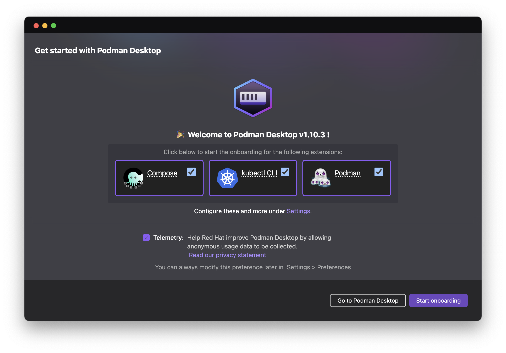
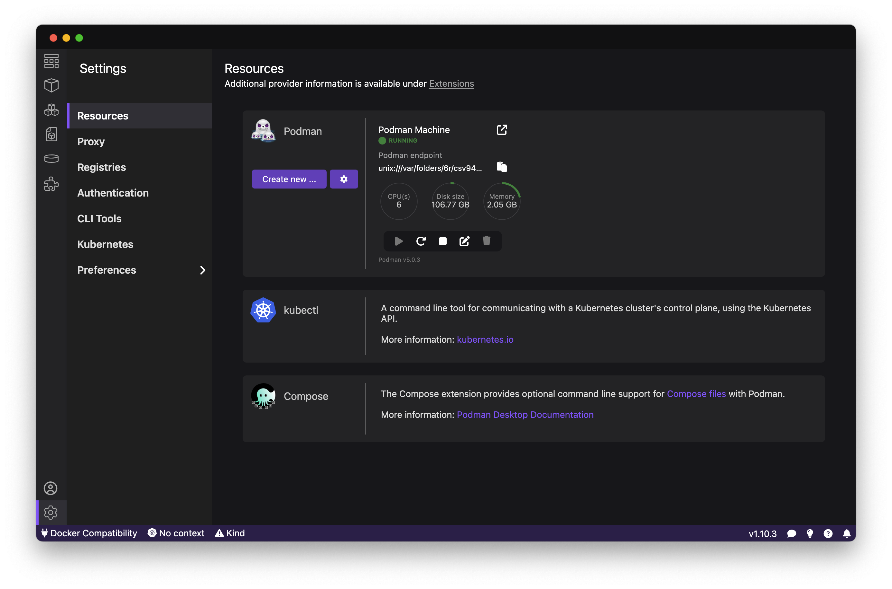
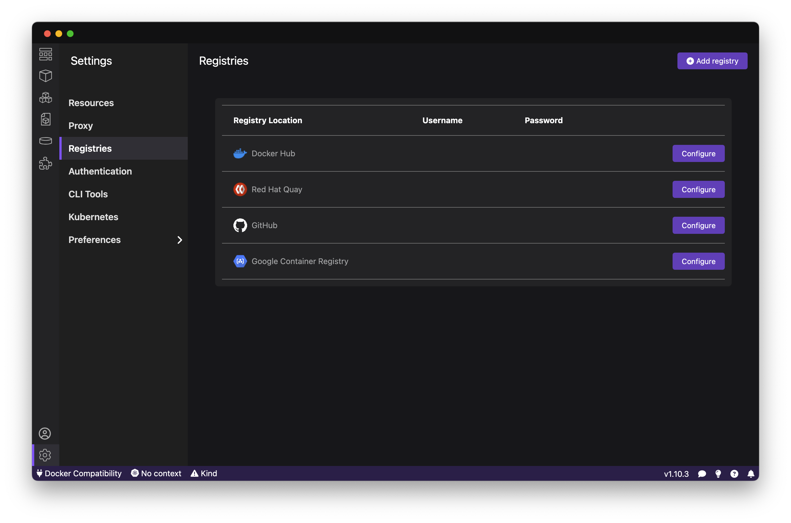
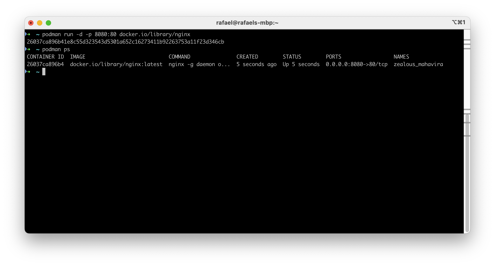
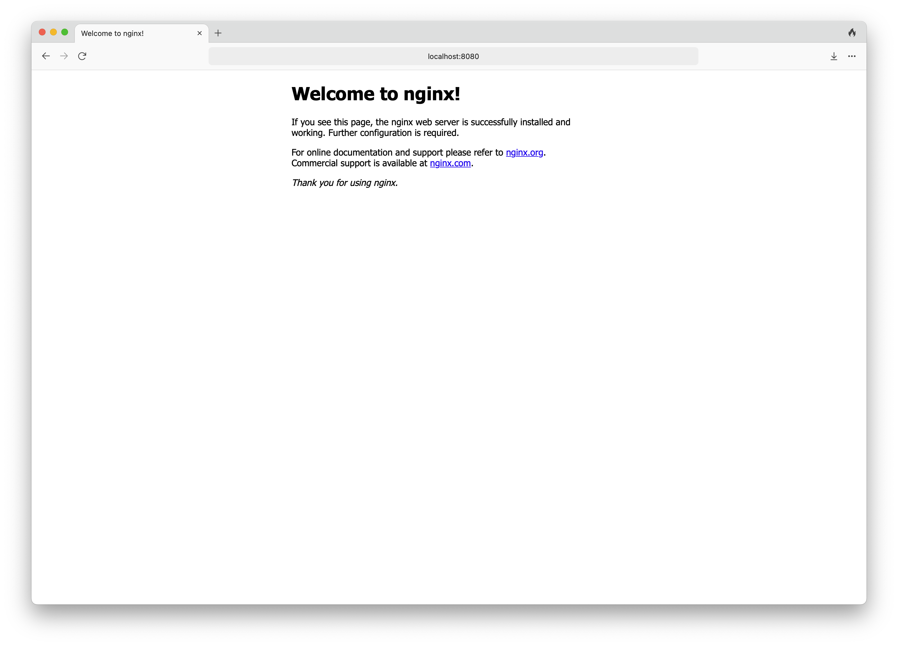

# hello-podman

Playing with Podman

## Introduction


### Podman vs Docker

Podman and Docker share many features in common but have some fundamental differences. These don't make one better than the other but might be decisive to select the most appropriate for a specific project.

The main point is the archtecture, Docker uses a daemon, it's an ongoing program running in background that runs with root privileges (There is a way to install a rootless docker also but it's not the default). In the other way, podman has no daemon allowing non-root privileges for cotainers that is considered safer.

As Podman has no daemon, it needs another tool to manage services and supporting running containers in the background. Systemd is the answer, it creates control unints for existing containers or generate new ones.\

But, what is systemd? [Here we go](https://documentation.suse.com/smart/systems-management/html/systemd-basics/index.html)

A bit deeper on [Podman + systemd](https://www.redhat.com/sysadmin/podman-run-pods-systemd-services)

## Installing podman


## Podman Desktop

Podman has a nice alternative to docker destop: [Podman Desktop](https://podman-desktop.io) 

### Installing podman desktop using homebrew

```
brew install podman-desktop
```

the result:
```
==> Downloading https://formulae.brew.sh/api/formula.jws.json
######################################################################### 100.0%
==> Downloading https://formulae.brew.sh/api/cask.jws.json
######################################################################### 100.0%
==> Downloading https://github.com/containers/podman-desktop/releases/download/v
==> Downloading from https://objects.githubusercontent.com/github-production-rel
######################################################################### 100.0%
==> Installing Cask podman-desktop
==> Moving App 'Podman Desktop.app' to '/Applications/Podman Desktop.app'
🍺  podman-desktop was successfully installed!
```




## Running a container

###  Adding a registry

This step is not required to run a container, but if you want to use images from the Docker Hub or use any other container registry, you must authenticate your podman desktop.

First go to the Settigns Menu:




Then go to Registries:



On Registries you can authenticate to one of the available options, or use the button Add registry to add a custom container registry.


### Running a container using an image from docker hub

Podman is very similar to docker, the command line syntax is basically the same, you only need to replace docker for podman, see:

```
podman run -d -p 80:80 docker.io/library/nginx

```




After running the container, is possible to see the container running using ``` podman ps``` command. Accessing the address ```localhost:8080 ``` :

